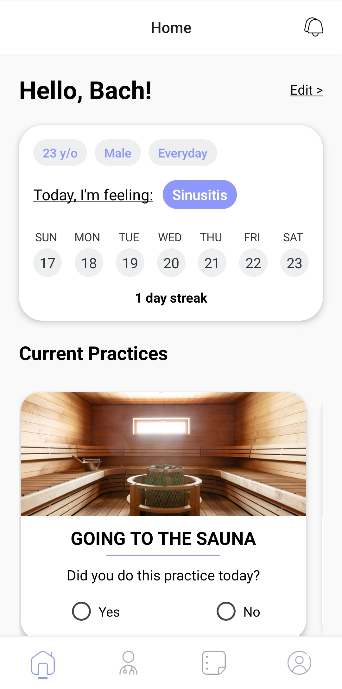
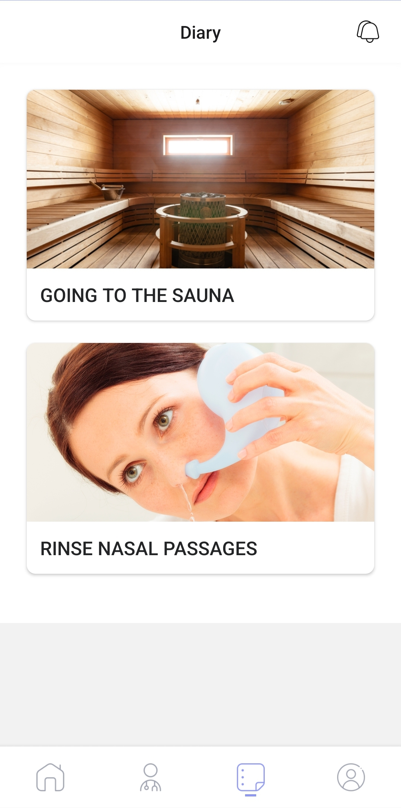
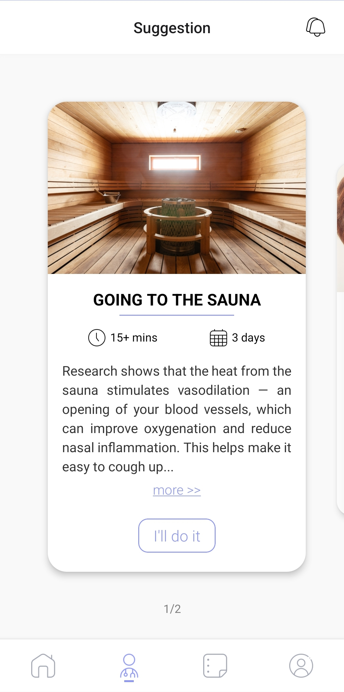
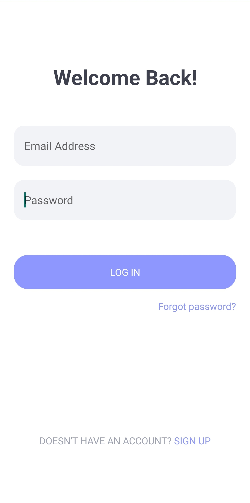
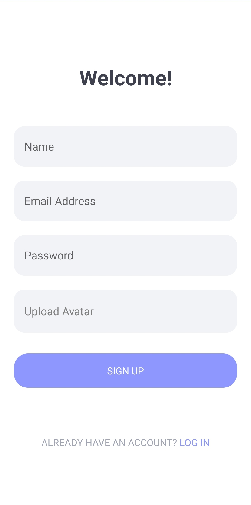

# VineHealth: a social network focus on Health

## Description

This is our product to the Hackathon Junction 2023 - topic from Tietoevry.


VineHealth is a sustainable chronic pain management app that offers personalized, non-medication practices by analyzing user patterns and connecting them with friends who share similar issues, providing motivation and support.

The application will provide you suitable practices based on your current condition (which you have to input) and users can choose the practices to work on. Users can share their experiences on each practice so that other users can learn from. Implemented on React Native, Expo & TypeScript.

Additional features:

- [Firebase](https://firebase.google.com/) to store users data and practices using Cloud Firestore and Storage
- [Firebase Authentication](https://firebase.google.com/docs/auth) for authentication
- [Native Stack](https://reactnavigation.org/docs/native-stack-navigator/) for app navigation
- [Snap Carousel](https://www.npmjs.com/package/react-native-snap-carousel) carousel to show list of practices

## Screenshots

{: width="30%" style="padding-right: 10px;"}
{: width="30%" style="padding-right: 10px;"}
{: width="30%" style="padding-right: 10px;"}

{: width="30%" style="padding-right: 10px;"}
{: width="30%" style="padding-right: 10px;"}
{: width="30%"}

<br/>

## Demo


## Install

Clone the repo:

```
$ git clone https://github.com/alvinle2901/VineHealth.git
```

Launch:

```
$ cd client
$ npm install
$ npx expo start
```

## APKs
